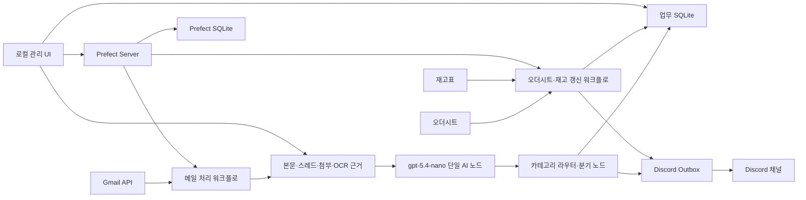
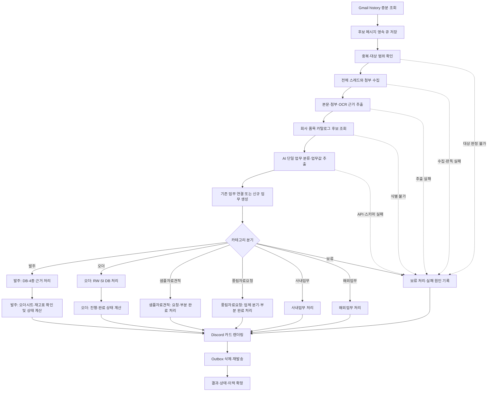
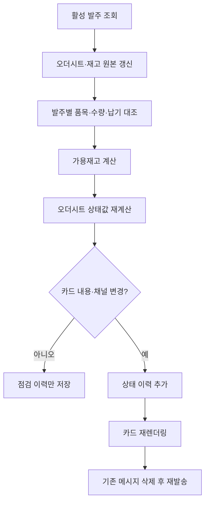
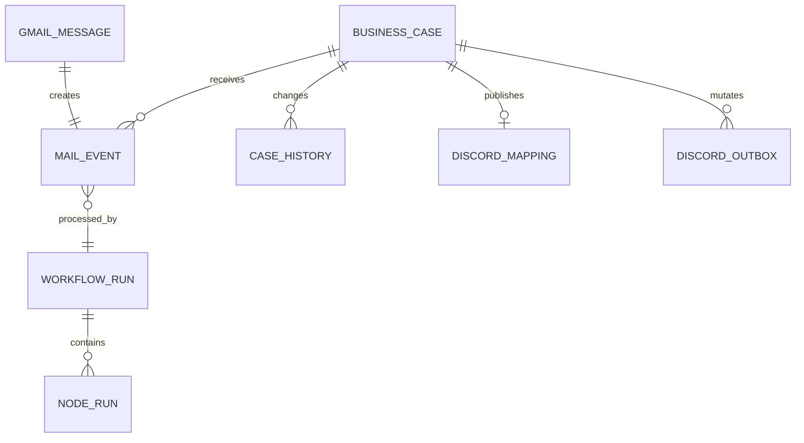

# 차세대 풍멜이 최종 설계서

- 문서 상태: 구현 기준 확정
- 기준 기획서: `project_architecture.md`
- 레거시 참고 문서: `legacy_project_architecture.md`
- 작성 기준일: 2026-08-01

## 1. 목표

기존 풍멜이의 Gmail 수집, 첨부 판독, 발주 사이트 조회, 오더시트 비교, 재고 계산, Discord 카드 처리 로직을 최대한 재사용하면서 거대한 단일 실행 구조를 추적 가능한 워크플로 구조로 재구성한다.

최종 시스템은 다음을 만족해야 한다.

- Gmail 대상 메일을 1분마다 증분 수집한다.
- 처리 대상 메일 한 건은 하나의 처리 이벤트만 만든다.
- 처리 이벤트는 신규 업무 하나를 만들거나 기존 업무 하나만 갱신한다.
- 업무 카테고리는 정확히 하나만 선택한다.
- 처리 대상 메일은 정상 카테고리 또는 `보류` 중 하나로 반드시 Discord에 도달한다.
- 발주 상태는 신규 메일 처리 시 즉시 확인하고, 이후 1시간마다 다시 확인한다.
- 워크플로 구성, 실행 이력, 노드 상태, 로그와 업무 데이터를 로컬 관리 UI에서 조회한다.
- 과거 메일을 저장된 근거로 다시 실행하되 기본적으로 외부 시스템을 변경하지 않는 Dry-run으로 검증한다.

## 2. 확정된 제품 원칙

### 2.1 메일과 업무의 단위

- `Gmail 메시지 1건 = 메일 처리 이벤트 1건`이다.
- 메일 처리 이벤트 하나가 여러 업무를 만들지 않는다.
- 하나의 메일에 여러 PO나 여러 요청이 있어도 하나의 업무 데이터와 하나의 Discord 카드에 함께 담는다.
- 회신 메일은 새 업무를 만들 수도 있지만, 기존 요청의 후속 처리로 식별되면 기존 업무 하나만 갱신한다.
- 여러 메일이 하나의 업무에 연결될 수 있지만 메일 하나가 여러 업무에 연결되지는 않는다.
- 샘플·자료·견적은 하나의 복합 업무로 관리한다.

### 2.2 카테고리

표준 카테고리는 다음 7개로 고정한다.

1. `발주`
2. `오더`
3. `샘플자료견적`
4. `풍림자료요청`
5. `사내업무`
6. `해외업무`
7. `보류`

문서의 `샘플자료견젹` 표기는 `샘플자료견적`으로 정정한다.

### 2.3 AI의 책임

- 의미 기반 분류와 업무값 추출은 Python 규칙 분류기가 아니라 AI가 수행한다.
- AI 처리는 메일 워크플로 안의 단일 노드·단일 API 요청으로 구성한다.
- 모델은 `gpt-5.4-nano`로 고정한다.
- OpenAI Responses API와 Pydantic 기반 Structured Outputs를 사용한다.
- AI는 Gmail, SQLite, Discord를 직접 수정하지 않는다.
- Python은 입력 수집, 외부 근거 조회, 스키마 검증, 정확 식별값 조회, 상태 계산, 렌더링, 외부 반영만 담당한다.
- AI 호출 실패, 거부, 시간 초과, 스키마 오류는 추정 결과로 우회하지 않고 `보류` 처리 근거가 된다.

`gpt-5.4-nano`는 분류·데이터 추출용 모델이며 Responses API와 Structured Outputs를 지원한다. 구현 시 공식 모델 ID를 그대로 사용한다.

### 2.4 Discord 갱신 방식

- 기존 메시지의 단순 수정은 사용하지 않는다.
- 업무 내용 또는 목적지 채널이 변경되면 기존 메시지를 삭제하고 갱신된 메시지를 새로 발송한다.
- 삭제 전 기존 메시지 ID, 채널, 본문과 본문 해시를 저장한다.
- 삭제 성공 후 신규 발송이 실패하면 `REPOST_PENDING` 상태로 남기고 성공할 때까지 재시도한다.
- 새 메시지 ID와 본문을 재조회해 확인한 뒤에만 업무의 현재 Discord 매핑을 교체한다.
- 내용과 채널이 변하지 않은 주기 갱신은 재발송하지 않는다.
- 내용이 Discord 본문 한도를 넘으면 요약 본문과 전체 상세 첨부파일을 한 메시지로 발송해 업무당 카드 한 개를 유지한다. 첨부까지 전송할 수 없으면 내용을 누락하지 않고 `보류`로 전환한다.

### 2.5 운영 환경

- 운영 위치: 현재 Windows 로컬 PC
- 사용자: 한 명
- UI 인증: 없음
- UI와 Prefect 서버는 `127.0.0.1`에만 바인딩한다.
- Docker와 외부 클라우드 서비스는 필수 구성에 포함하지 않는다.
- 신규 업무 DB는 빈 SQLite로 시작한다.
- 기존 SQLite는 자동 이관하지 않으며 필요할 때만 읽기 전용 보조 근거로 사용한다.

## 3. 전체 구조



## 4. 기술 기준

| 영역 | 기준 |
|---|---|
| 언어 | 기존 운영환경과 같은 Python 3.14 계열 |
| 워크플로 엔진 | Prefect 3, 구현 시 검증한 정확 버전으로 고정 |
| 워크플로 DB | Prefect 전용 SQLite |
| 업무 DB | SQLite WAL + SQLAlchemy 2 + Alembic |
| API·관리 UI | FastAPI + 서버 렌더링 템플릿 + 필요한 최소 JavaScript |
| AI | OpenAI Responses API, `gpt-5.4-nano`, Pydantic Structured Outputs |
| 스케줄 | 메일 1분, 발주 상태 갱신 1시간 |
| 파일 추출 | 레거시 PDF·Excel·DOCX·ZIP·이미지/OCR 로직 재사용 |
| 브라우저 자동화 | 기존 `Pungmail Order Sites` 프로젝트를 읽기 전용 어댑터로 호출 |
| 로그 | JSON 구조 로그 + Prefect 실행 로그 |
| 시간 기준 | 모든 업무 시간은 `Asia/Seoul`, DB 시각은 UTC 저장 |

Prefect는 단일 서버 환경에서 SQLite를 지원하고 실행·태스크 상태, 이력과 로그를 관리한다. Python 3.14 지원이 포함된 Prefect 버전 이상을 사용하며 클라이언트와 서버 버전을 동일하게 고정한다.

## 5. 실행 프로세스

로컬 시작 스크립트 하나가 다음 프로세스를 실행하고 상태를 확인한다.

1. Prefect 로컬 서버
2. Prefect worker
3. 차세대 풍멜이 API·관리 UI
4. 두 워크플로 deployment와 schedule

기본 포트는 다음과 같다.

- 관리 UI: `127.0.0.1:8000`
- Prefect 개발 UI/API: `127.0.0.1:4200`

정상 시작은 프로세스 생성만으로 판정하지 않는다. 각 프로세스의 health endpoint, DB 연결, 워크플로 deployment와 다음 예약 시각을 확인해야 한다.

## 6. 프로젝트 구조

```text
poongmel-automization/
├─ src/pungmail/
│  ├─ api/                 # FastAPI와 관리 UI 라우트
│  ├─ workflows/           # 정확히 2개의 Prefect flow
│  ├─ nodes/               # 재사용 가능한 workflow node
│  ├─ domain/              # 업무 모델, 상태기계, 정책
│  ├─ services/            # 업무 유스케이스
│  ├─ repositories/        # SQLite 접근
│  ├─ adapters/
│  │  ├─ gmail/
│  │  ├─ openai/
│  │  ├─ discord/
│  │  ├─ ecount/
│  │  ├─ order_sites/
│  │  ├─ order_sheet/
│  │  ├─ stock/
│  │  └─ legacy/
│  └─ observability/
├─ prompt/
│  ├─ common.md
│  ├─ classification.md
│  └─ categories/
│     ├─ order.md
│     ├─ upstream_order.md
│     ├─ sample_document_quote.md
│     ├─ punglim_document_request.md
│     ├─ internal_work.md
│     ├─ overseas_work.md
│     └─ hold.md
├─ migrations/
├─ tests/
│  ├─ unit/
│  ├─ contract/
│  ├─ integration/
│  ├─ regression/
│  └─ fixtures/
├─ runtime/                # Git 제외
│  ├─ evidence/
│  ├─ logs/
│  ├─ prefect/
│  └─ backups/
├─ data/                   # Git 제외
│  └─ pungmail.db
├─ scripts/
└─ docs/
```

## 7. 워크플로 설계

### 7.1 메일 처리 워크플로

워크플로 ID는 `mail_processing`으로 고정하고 1분마다 실행한다. UI에서 저장 메일을 지정해 수동 Dry-run으로도 같은 워크플로를 실행한다.



`카테고리 분기` 뒤의 상자는 실제 관리 UI와 실행 이력에 표시되는 카테고리별 노드다. 한 실행에서는 AI가 결정한 분기 하나만 실행하고 선택되지 않은 분기는 `SKIPPED`로 표시한다.

- `발주`는 `발주 DB·4종 근거 처리`와 `오더시트·재고표 확인 및 상태 계산`을 차례로 실행한다.
- `오더`는 `RW·SI DB 처리`와 `진행·완료 상태 계산`을 차례로 실행한다.
- 나머지 카테고리도 각각 이름이 드러나는 전용 처리 노드를 실행한다.
- 선택된 분기에서 복구 불가능한 오류나 근거 충돌이 생기면 해당 노드의 실패 원인을 기록하고 `보류 처리` 노드로 이동한다.
- 이 분기들은 별도 workflow나 deployment가 아니라 하나의 `mail_processing` workflow 안의 조건부 노드다. 전체 workflow 수는 계속 두 개다.

#### 입력 범위

- Gmail 받은편지함에서 보낸사람·받는사람·참조 중 Richwood 관련 주소가 포함된 메일
- 읽음 여부 무관
- 스팸·휴지통·프로모션·소셜은 수집 대상에서 제외
- Gmail `historyId`를 사용한 증분 수집

#### 보류 원칙

수집 대상에 들어온 메일은 정상 카테고리로 확정되지 않더라도 `보류` 카드로 발송한다. 보류 카드에는 확인된 제목, 발신, 수신 시각, 실패 노드, 실패 유형과 확인할 항목만 표시하며 추정한 업체·품목·수량을 넣지 않는다.

Discord 장애로 보류 카드 자체를 보낼 수 없는 경우에는 Outbox에 남겨 재시도한다. 이 상태는 `보류 발송 완료`가 아니라 `보류 발송 대기`다.

### 7.2 오더시트·재고 갱신 워크플로

워크플로 ID는 `order_status_refresh`로 고정하고 1시간마다 실행한다.



활성 발주만 대상으로 한다. 완료·취소·종료된 발주는 자동 재검사하지 않는다.

## 8. 업무 연결과 상태 모델

### 8.1 메일 처리 이벤트와 업무



- `MAIL_EVENT.gmail_message_id`는 고유하다.
- `MAIL_EVENT.business_case_id`는 분류·보류 확정 전에는 비어 있을 수 있지만, 확정 후에는 정확히 하나다.
- 후속 회신은 thread ID, 원요청 Gmail ID, PO, RW, SI와 기존 업무키를 이용해 기존 업무 하나에 연결한다.
- 후보 업무가 없으면 신규 업무를 만든다.
- 후보가 여러 개면 임의 선택하지 않고 현재 메일 자체를 `보류` 업무로 처리한다.
- 한 메일에서 여러 업무 후보가 명시되어도 하나의 통합 업무만 선택한다.

### 8.2 공통 상태

메일 이벤트 상태:

`DISCOVERED → QUEUED → EXTRACTED → AI_DECIDED → CASE_APPLIED → DISCORD_PENDING → SENT`

예외 상태:

- `RETRY_WAIT`: 일시 오류 후 재시도 대기
- `HOLD`: 업무 판단 실패를 보류 업무로 확정
- `REPOST_PENDING`: 기존 Discord 삭제 후 신규 메시지 재발송 대기
- `FAILED`: workflow 또는 node의 개별 실행 시도가 자동 재시도 한도를 넘은 상태다. 처리 대상 mail event의 최종 상태로 사용하지 않는다.
- `SUPERSEDED`: 같은 Gmail 메시지의 더 최신 실행에 의해 대체

업무 상태는 카테고리별 상태기계가 관리하고 모든 변경을 `case_history`에 추가한다. 과거 이력은 덮어쓰지 않는다.

처리 대상 mail event는 의미·추출 오류가 복구되지 않으면 `HOLD` 업무와 보류 Outbox를 만들고, Discord 장애면 `DISCORD_PENDING` 또는 `REPOST_PENDING`으로 계속 남는다. 따라서 Discord에 도달하지 않은 채 `FAILED`로 종결하지 않는다.

## 9. 주요 데이터 모델

### 9.1 워크플로·메일·근거

| 테이블 | 목적 | 핵심 식별값 |
|---|---|---|
| `workflow_runs` | 앱 기준 워크플로 실행 | UUID, Prefect flow run ID |
| `node_runs` | 공통·분기 노드별 시도·입출력·오류·`SKIPPED` | workflow run ID + node key + attempt |
| `gmail_messages` | Gmail 원문 메타데이터 | Gmail message ID |
| `mail_attachments` | 첨부 원본·추출 결과 | attachment ID, SHA-256 |
| `mail_events` | 메일 한 건의 단일 처리 이벤트 | Gmail message ID unique |
| `evidence_snapshots` | OCR·사이트·시트·재고 근거 | type + source key + SHA-256 |
| `ai_decisions` | 구조화 AI 결과 | mail event ID, model, prompt bundle SHA |
| `business_cases` | 현재 업무 상태 | UUID, category, case key |
| `case_history` | 업무 변경 이력 | case ID + revision |

노드 입출력에는 비밀값과 서명 URL을 저장하지 않는다. 큰 본문과 바이너리는 DB가 아니라 `runtime/evidence`에 저장하고 DB에는 경로와 SHA-256을 저장한다.

### 9.2 발주

| 테이블 | 목적 |
|---|---|
| `orders` | 메일 단위 발주 업무 헤더 |
| `order_references` | 한 메일 안의 복수 PO·발주번호 보존 |
| `order_lines` | 품목·수량·납기·납품처 |
| `order_source_checks` | 본문·첨부·ECOUNT·사이트 검증 결과 |
| `order_sheet_matches` | 품목별 오더시트 일치 결과 |
| `stock_checks` | 재고·예약·가용·부족 계산 |
| `order_status_history` | 상태값과 Discord 채널 변경 이력 |

`order_sheet_ready`는 모든 발주 품목에 대해 다음 조건이 모두 참일 때만 `true`다.

1. 오더시트에서 업체·정확한 품목·수량·납기가 일치한다.
2. 최신 재고에서 미래 미출고 예약량을 뺀 가용재고가 해당 발주수량 이상이다.

한 품목이라도 일부 입력, 수량·납기 불일치, 가용재고 부족 또는 판독 실패이면 `false`다. 신규 발주에서 즉시 계산하고 이후 1시간 워크플로에서 동일한 레거시 계산 로직으로 갱신한다.

### 9.3 RW·SI

| 테이블 | 목적 |
|---|---|
| `rw_orders` | 공급사 + RW 번호 단위 상류 발주 |
| `rw_items` | RW 품목과 발주수량 |
| `si_shipments` | 실제 선적 단위 SI, 운송·ETA·입고 상태 |
| `si_items` | SI 품목과 선적수량 |
| `rw_si_allocations` | RW 품목과 SI 품목의 배정수량 다대다 연결 |

공급사가 다른 동일 RW 번호는 별도 업무다. RW 하나가 여러 SI로 나뉘거나 SI 하나가 여러 RW 품목을 포함할 수 있다. 관리 UI는 양방향 링크를 제공한다.

### 9.4 샘플·자료·견적과 풍림자료요청

| 테이블 | 목적 |
|---|---|
| `request_cases` | 요청 업무 헤더 |
| `request_items` | 요청 품목 |
| `request_components` | 샘플·자료·견적 또는 개별 요청 항목 |
| `request_component_history` | 부분 완료 이력 |

각 구성요소는 `REQUESTED`, `IN_PROGRESS`, `COMPLETED`, `NOT_APPLICABLE` 상태를 가진다. 일부 완료는 같은 업무와 카드에서 완료 항목을 취소선으로 표시한다. 전부 완료되면 완료 채널로 이동한다.

## 10. AI와 프롬프트 설계

### 10.1 프롬프트 관리

- 프롬프트는 `prompt/` 아래에서 파일별로 관리한다.
- 공통 안전 규칙, 분류 규칙, 7개 카테고리 규칙을 분리한다.
- 런타임에는 정해진 순서로 하나의 안정된 프롬프트 묶음을 만든다.
- 각 파일과 전체 묶음의 SHA-256을 저장한다.
- UI에서는 프롬프트와 버전을 조회만 할 수 있고 편집할 수 없다.
- 레거시 `pungmail_policy.md`, 관리 `AGENTS.md`, 기존 분석·렌더링 로직에서 재사용 가능한 규칙을 추출한다.
- 레거시와 신규 기획이 충돌하면 신규 기획을 우선한다.

### 10.2 단일 AI 노드 출력

AI 노드는 공통 필드와 카테고리별 payload를 한 번에 반환한다.

공통 필드:

- `category`
- `case_action`: `CREATE` 또는 `UPDATE`
- `case_lookup_keys`
- `company`
- `subject`
- `summary`
- `missing_fields`
- `evidence_refs`
- `category_payload`

`category_payload`는 카테고리별 Pydantic 모델의 판별 가능한 union으로 정의한다. Python SDK의 `responses.parse`와 Pydantic 타입을 단일 원천으로 사용하고 별도 수기 JSON Schema를 중복 관리하지 않는다.

### 10.3 품목명 규칙

- 회사 취급 여부와 표기는 `company-beauty-items.ndjson`을 우선한다.
- 회사 표시에는 `companyDisplayName`을 사용한다.
- 선두의 독립된 `NIKKOL`, `PROMOIS`만 제거한다.
- `NIKKOMIX`, `NIKKOMULESE`, `NIKKOSOME`, `NIKKOFINE`은 자르지 않는다.
- 업체 표시는 `productGroup` 기준의 `업체(제품군 기준)`을 별도 보존한다.
- 같은 표시명에 여러 품목코드·규격이 있으면 후보를 모두 저장한다.
- 실행 대상이 규격에 따라 달라지는데 구분 근거가 없으면 보류한다.
- 상품명만으로 INCI나 조성을 추정하지 않는다.
- `삭제` 표기 품목은 현재 취급 후보에서 제외한다.
- 풍림자료요청의 NIKKO·SEIWA Discord 라우팅은 레거시의 실제 거래 상대 공급사 판별 로직을 재사용하고 카탈로그 제품군 표시와 혼동하지 않는다.

## 11. 카테고리별 처리

### 11.1 발주

다음 4개 근거 중 해당되는 것을 모두 수집한다.

1. 실제 작성문
2. PDF·Excel·이미지 첨부 발주서
3. ECOUNT 수신문서 원본
4. 고객사 발주 사이트

발주 데이터와 검증 근거를 저장한 뒤 오더시트·재고를 즉시 확인한다.

- `order_sheet_ready=true` → `오더시트` 채널
- `order_sheet_ready=false` → `발주` 채널

### 11.2 오더

- RW와 SI를 별도 장부로 저장한다.
- 메일 하나는 하나의 오더 업무만 생성 또는 갱신한다.
- 진행 중이면 레거시 분류에 따라 `rw` 또는 `si` 채널로 보낸다.
- 완료 조건을 모두 만족하면 `완료` 채널로 보낸다.

오더 Discord 채널은 문서의 잘못된 `2개` 표기를 고쳐 `rw`, `si`, `완료` 총 3개로 정의한다.

### 11.3 샘플자료견적

- 샘플·자료·견적을 하나의 복합 업무로 저장한다.
- 신규 요청은 `진행중` 채널에 게시한다.
- 후속 메일은 기존 업무를 찾아 구성요소별 완료 상태를 갱신한다.
- 일부 완료는 같은 카드에 완료 항목을 취소선으로 표시한다.
- 모두 완료되면 `완료` 채널로 이동한다.

### 11.4 풍림자료요청

- 신규 요청은 실제 공급사 판별에 따라 `nikko`, `seiwa`, `기타` 중 하나로 보낸다.
- 후속 메일은 기존 업무의 개별 요청 항목을 부분 완료한다.
- 전부 완료되면 `완료` 채널로 이동한다.

### 11.5 사내업무·해외업무·보류

- 사내업무 → `사내업무` 채널
- 해외업무 → `해외업무` 채널
- 보류 → `보류` 채널

보류 카드에는 실패 원인, 실패 노드, 재시도 상태와 운영자가 확인할 항목을 포함한다.

## 12. Discord Outbox 설계

모든 Discord 변경은 DB 트랜잭션과 분리된 영속 Outbox를 통한다.

### 신규 발송

1. 렌더링한 본문과 목적지 채널을 Outbox에 저장한다.
2. idempotency key로 중복 발송을 차단한다.
3. Discord에 발송한다.
4. 새 message ID와 본문을 다시 확인한다.
5. 현재 매핑을 저장하고 Outbox를 완료한다.

### 갱신 발송

1. 기존 매핑과 실제 메시지를 조회한다.
2. 기존 본문·채널·message ID를 백업한다.
3. 기존 메시지를 삭제한다.
4. 갱신된 본문을 목적지 채널에 새로 발송한다.
5. 새 message ID와 실제 본문을 확인한다.
6. 현재 매핑을 교체한다.

3단계 이후 실패하면 `REPOST_PENDING`으로 유지한다. 같은 idempotency key의 worker만 이어서 처리하며 또 다른 메시지를 만들지 않는다.

## 13. 관리 UI

관리 UI는 편집 도구가 아니라 조회·검증 도구다.

### 13.1 화면

- 대시보드: 프로세스 상태, 다음 예약, 최근 실패, Outbox 대기
- 워크플로: 두 워크플로의 노드 구성, 카테고리 라우터·7개 분기와 현재 버전
- 실행 이력: 실행별 시작·종료·상태·트리거
- 실행 상세: 선택된 카테고리 경로 강조, 미선택 분기 `SKIPPED`, 시도 횟수, 안전하게 가린 입출력과 오류
- 메일 근거: 본문, 스레드, 첨부, OCR·추출문, 해시
- 업무: 현재 카테고리, 상태, Discord 매핑과 변경 이력
- 발주: 품목, 오더시트 매칭, 재고·가용·부족, 상태 이력
- RW·SI: 장부 목록과 상하위 양방향 링크
- 검증: 저장 메일 선택, Dry-run 실행, 예상 카드 비교
- 로그: 워크플로·노드·서비스별 필터

### 13.2 금지 기능

- 프롬프트 편집
- 워크플로 노드 편집
- Gmail 원문 수정
- 오더시트·재고표 수정
- UI Dry-run에서 Discord 발송
- UI에서 비밀값 표시

## 14. 과거 메일 검증 데이터

개발 완료 후 별도 수집 스크립트로 과거 메일을 읽어 다음을 저장한다.

- Gmail 메시지·스레드 메타데이터
- 본문 원문과 실제 작성문 분리 결과
- 첨부파일 원본
- 파일명, MIME, 크기, SHA-256
- PDF·Excel·DOCX·ZIP 추출문
- 이미지·PDF OCR 결과
- 추출 경고와 실패 원인

원본과 첨부는 `runtime/evidence`에 보관하고 Git에서 제외한다. 비식별화된 회귀 fixture만 `tests/fixtures`에 포함한다.

수동 Dry-run은 동일한 메일 처리 워크플로를 사용하지만 다음 어댑터를 강제로 비활성화한다.

- Discord 생성·삭제
- 운영 업무 DB 갱신
- Gmail 상태 변경
- 외부 사이트의 변경 작업

Dry-run 결과는 별도 검증 실행과 예상 카드로 저장한다.

## 15. 로깅·재시도·복구

모든 로그에는 가능한 경우 다음 상관 식별값을 포함한다.

- workflow run ID
- Prefect flow/task run ID
- Gmail message ID와 thread ID
- mail event ID
- business case ID
- PO, RW, SI
- Discord outbox ID와 message ID

재시도는 오류 유형별로 구분한다.

- Gmail·OpenAI·Discord 네트워크와 rate limit: 지수 backoff
- 첨부·OCR 일시 실패: 제한 재시도 후 보류
- 사이트 로그인·조회 실패: 제한 재시도 후 보류
- 스키마·근거 충돌: 자동 반복하지 않고 보류
- Discord 삭제 후 발송 실패: `REPOST_PENDING` 전용 재시도

비밀값, OAuth token, API key, 사이트 비밀번호와 서명 URL query는 로그·DB·Prefect 파라미터에 넣지 않는다.

## 16. 테스트 전략

### 16.1 단위 테스트

- 상태기계와 라우팅
- 카테고리 라우터의 단일 분기 선택과 미선택 노드 `SKIPPED`
- 가용재고와 `order_sheet_ready`
- 품목명 정규화와 중복 후보
- 카드 렌더링
- Outbox 전이

### 16.2 계약 테스트

- 레거시 Gmail·첨부 추출 함수
- ECOUNT·고객사 사이트 조회 결과
- 오더시트·재고 파서
- OpenAI Structured Output 스키마
- Discord webhook 클라이언트

### 16.3 회귀 테스트

- 레거시 39개 테스트와 최신 행동강령 사례를 신규 인터페이스로 이관
- 한 메일에서 여러 업무가 생성되지 않음
- 후속 메일이 기존 업무 하나만 갱신함
- 모든 처리 대상 메일이 정상 카테고리 또는 보류로 귀결됨
- 같은 메시지와 업무의 Discord 중복이 없음

### 16.4 인수 테스트

- 실제 메일 표본 Dry-run
- 7개 카테고리별 최소 1건
- 발주 4종 근거별 최소 1건
- 샘플·자료·견적 부분 완료
- 풍림자료요청 부분 완료
- RW 하나의 복수 SI와 SI 하나의 복수 RW 연결
- 1시간 갱신으로 발주 채널이 바뀌는 사례
- Discord 삭제 후 재발송 실패 복구

## 17. 운영 전환

1. 신규 빈 DB와 Dry-run 모드로 시작한다.
2. 과거 메일 표본과 최신 신규 메일을 신규 시스템에서 검증한다.
3. 기존 시스템은 계속 운영하고 신규 시스템은 Discord 변경을 차단한다.
4. 카테고리, 카드, 발주 상태와 RW·SI 장부를 비교한다.
5. 인수 기준을 만족하면 기존 모니터를 중지한다.
6. 신규 시스템의 실제 Discord 발송을 활성화한다.
7. 첫 실제 메일과 첫 1시간 갱신을 확인한다.
8. 실패 시 신규 시스템을 중지하고 기존 시스템을 재개할 수 있게 기존 파일과 DB를 변경하지 않는다.

기존 DB의 자동 마이그레이션은 하지 않는다. 활성 업무를 반드시 이어야 하는 경우에만 별도 읽기 전용 가져오기 절차를 작성해 사용한다.

## 18. 완료 기준

- 정확히 두 개의 워크플로만 존재한다.
- 메일은 1분, 발주 갱신은 1시간 주기로 실행된다.
- 메일 하나가 두 개 이상의 처리 업무를 만들지 않는다.
- 카테고리별 분기 노드가 UI에 보이고 실행된 경로와 `SKIPPED` 경로가 구분된다.
- 모든 처리 대상 메일은 정상 카테고리 또는 보류 Discord 카드로 귀결된다.
- 실패 원인과 노드 상태가 UI와 로그에 남는다.
- 발주 `order_sheet_ready`가 레거시 로직과 동일한 결과를 낸다.
- Discord 갱신은 기존 메시지 삭제 후 새 메시지 발송으로 알림을 만든다.
- 발주·RW·SI 데이터와 이력이 UI에서 조회된다.
- RW·SI를 양방향으로 이동할 수 있다.
- 과거 메일을 Dry-run하고 노드별 결과와 예상 카드를 볼 수 있다.
- 로컬 재시작 후 대기 메일과 Outbox가 유실되지 않는다.
- 기존 시스템 파일과 DB는 손상되지 않는다.

## 19. 구현 이슈

1. 관찰 가능한 메일 수집 플랫폼 구축
2. AI 분류·카테고리 처리·Discord 자동화 구축
3. 국내 발주 전체 자동화 구축
4. 오더·RW·SI 및 시간별 상태 갱신 구축
5. 과거 메일 검증·통합 안정화·운영 전환

## 20. 기술 참고

- [Prefect self-hosted server와 SQLite](https://docs.prefect.io/v3/concepts/server)
- [Prefect Python 설치 기준](https://docs.prefect.io/v3/get-started/install)
- [Prefect Python 3.14 지원 릴리스](https://docs.prefect.io/v3/release-notes/oss/version-3-4)
- [OpenAI GPT-5.4 nano](https://developers.openai.com/api/docs/models/gpt-5.4-nano)
- [OpenAI Structured Outputs](https://developers.openai.com/api/docs/guides/structured-outputs)
